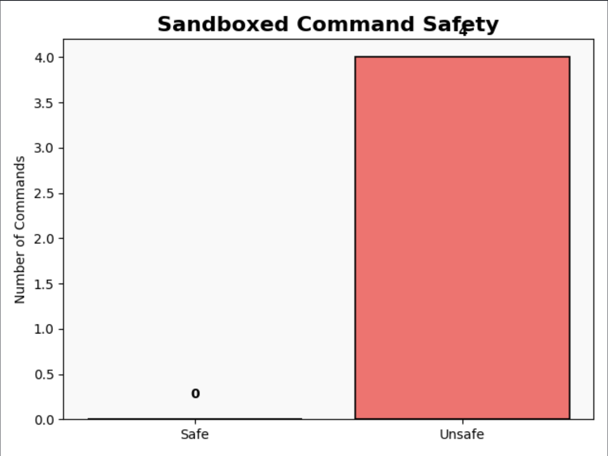
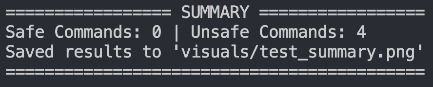

Got it —  
you want your **OS Capstone** README to be **beautifully styled like that** (𝘭𝘪𝘬𝘦 PhishKiller's), matching those fonts, badges, and elegant sections.

Here’s your full **refactored README**, in the same **exact style**:

---

# 𝘖𝘚 𝘊𝘢𝘱𝘴𝘵𝘰𝘯𝘦 – 𝘚𝘦𝘤𝘶𝘳𝘪𝘯𝘨 𝘵𝘩𝘦 𝘚𝘺𝘴𝘵𝘦𝘮: 𝘚𝘢𝘯𝘥𝘣𝘰𝘹𝘪𝘯𝘨 𝘢𝘴 𝘢 𝘔𝘰𝘥𝘦𝘳𝘯 𝘖𝘚 𝘚𝘦𝘤𝘶𝘳𝘪𝘵𝘺 𝘔𝘦𝘤𝘩𝘢𝘯𝘪𝘴𝘮


[](https://www.python.org)
[](#)

---

## 𝘖𝘷𝘦𝘳𝘷𝘪𝘦𝘸

A Python-based simulation and visualization project exploring how sandboxing mechanisms help prevent unauthorized access to system resources through **process isolation**, **system call filtering**, and **access control**.

This project showcases how sandboxing—specifically using [Firejail](https://github.com/netblue30/firejail)—enhances operating system security.

---

## 𝘛𝘦𝘢𝘮 𝘔𝘦𝘮𝘣𝘦𝘳𝘴

- Vanessa Benavente  
- Killian Bertsch  
- Mohammad Besharat  
- Matthew Ruediger  

---

## 𝘍𝘦𝘢𝘵𝘶𝘳𝘦𝘴

- Simulates real-world attack scenarios (file, network, privilege escalation)
- Demonstrates process isolation with and without sandboxing
- Generates clear visualizations (safe vs unsafe actions)
- Highlights Linux-based sandboxing technologies (Firejail, seccomp, namespaces)
- Fully modular Python scripts

---

## 𝘚𝘦𝘵𝘶𝘱 𝘐𝘯𝘴𝘵𝘳𝘶𝘤𝘵𝘪𝘰𝘯𝘴

### 𝘙𝘦𝘲𝘶𝘪𝘳𝘦𝘮𝘦𝘯𝘵𝘴

- Ubuntu 20.04+  
- Python 3.x  
- Firejail  
- Matplotlib Python library

---

### 𝘊𝘭𝘰𝘯𝘦 𝘵𝘩𝘦 𝘙𝘦𝘱𝘰𝘴𝘪𝘵𝘰𝘳𝘺

```bash
git clone https://github.com/yourusername/os-capstone.git
cd os-capstone
```

---

### 𝘐𝘯𝘴𝘵𝘢𝘭𝘭 𝘋𝘦𝘱𝘦𝘯𝘥𝘦𝘯𝘤𝘪𝘦𝘴

```bash
sudo apt update
sudo apt install firejail python3 python3-pip
pip3 install -r requirements.txt
```

---

## 𝘙𝘶𝘯𝘯𝘪𝘯𝘨 𝘵𝘩𝘦 𝘗𝘳𝘰𝘫𝘦𝘤𝘵

### 𝘈𝘵𝘵𝘢𝘤𝘬 𝘚𝘤𝘦𝘯𝘢𝘳𝘪𝘰𝘴

Simulate attacks (unsandboxed):

```bash
python3 bad_script.sh
```

Simulate attacks (sandboxed):

```bash
firejail bash bad_script.sh
```

Logs will appear in the `/results/` folder.

---

### 𝘔𝘢𝘯𝘶𝘢𝘭 𝘊𝘰𝘮𝘮𝘢𝘯𝘥 𝘛𝘦𝘴𝘵𝘪𝘯𝘨

Check any command manually:

```bash
python3 test.py ls -la
```

Or, if no command is given, run preset attack tests and generate a **visual summary**:

```bash
python3 test.py
```

Generated charts will be saved to `/visuals/`.

---

## 𝘋𝘦𝘭𝘪𝘷𝘦𝘳𝘢𝘣𝘭𝘦𝘴

- Full Source Code
- Attack Scenario Logs (`/results/`)
- Visual Summaries (`/visuals/`)
- [Capstone Presentation Slides](https://olucdenver-my.sharepoint.com/:p:/g/personal/vanessa_benavente_ucdenver_edu/EdDpQnrzFnlJigiEMT-agQ8B8_FfiwXYSOkmdRw0xIx8AA?e=jwRJB0)
- [Research Report](https://docs.google.com/document/d/1F-AweAtG0pEalSz2Hs1eE6Vv7kvXwJZo6tNyZNBZ-HE/edit?tab=t.0)

---

## 𝘚𝘢𝘮𝘱𝘭𝘦 𝘖𝘶𝘵𝘱𝘶𝘵 (𝘊𝘖𝘔𝘐𝘕𝘎 𝘚𝘖𝘖𝘕)

Example bar chart comparing safe vs unsafe actions here and soon to be replaced by a more accurate one.




---

## 𝘗𝘳𝘰𝘫𝘦𝘤𝘵 𝘛𝘩𝘦𝘮𝘦

This project explores:

- **Process Isolation**
- **Access Control**
- **System Call Filtering**
- **Privilege Containment**

This project highlights how sandboxing improves operating system security by enforcing process isolation and access control, while also addressing real-world limitations like performance overhead. It connects these concepts to modern OS trends such as containerization (e.g., Docker) and lightweight virtualization with microVMs (e.g., Firecracker), demonstrating how operating systems continue to evolve to manage processes more securely and efficiently.

---

## 𝘊𝘳𝘦𝘥𝘪𝘵𝘴

Developed by the Group #2 OS Capstone Team for CSCI 3453 with concept structure and visualization flow assisted by ChatGPT.  

---
