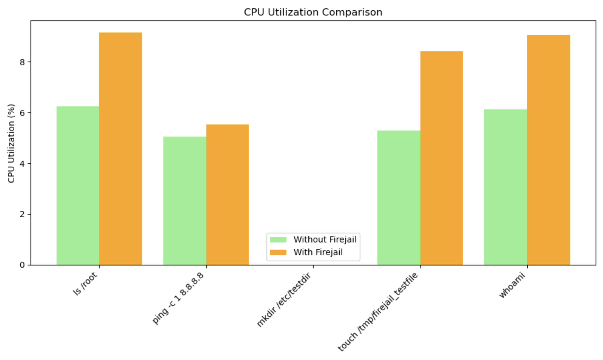
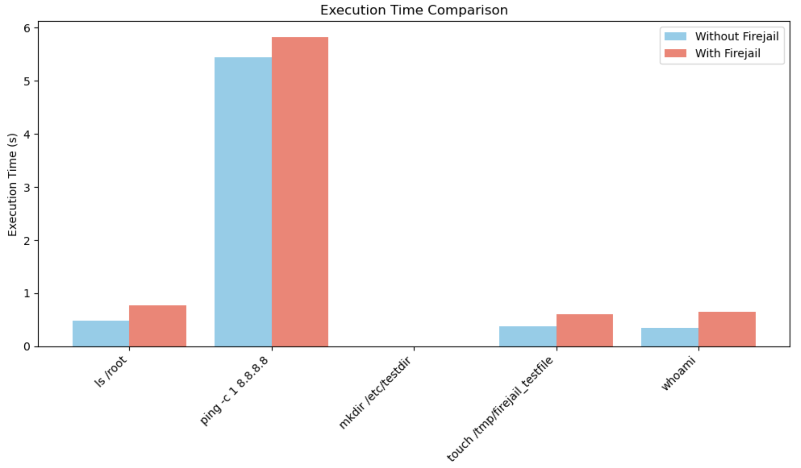
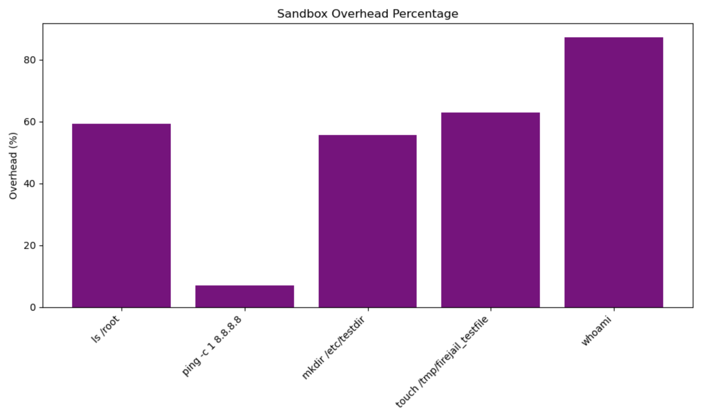

# 𝘖𝘚 𝘊𝘢𝘱𝘴𝘵𝘰𝘯𝘦 – 𝘚𝘦𝘤𝘶𝘳𝘪𝘯𝘨 𝘵𝘩𝘦 𝘚𝘺𝘴𝘵𝘦𝘮: 𝘚𝘢𝘯𝘥𝘣𝘰𝘹𝘪𝘯𝘨 𝘢𝘴 𝘢 𝘔𝘰𝘥𝘦𝘳𝘯 𝘖𝘚 𝘚𝘦𝘤𝘶𝘳𝘪𝘵𝘺 𝘔𝘦𝘤𝘩𝘢𝘯𝘪𝘴𝘮


[](https://www.python.org)
[](#)

---

## 𝘖𝘷𝘦𝘳𝘷𝘪𝘦𝘸  
A lightweight Python-based simulation using Firejail to demonstrate how Linux sandboxing protects against unauthorized file access, privilege escalation, and system-level threats. Includes a benchmarking tool, sandbox enforcement checks, and visual performance analysis.

---

## 𝘛𝘦𝘢𝘮 𝘔𝘦𝘮𝘣𝘦𝘳𝘴  
- Vanessa Benavente  
- Killian Bertsch  
- Mohammad Besharat  
- Matthew Ruediger  

---

## 𝘍𝘦𝘢𝘵𝘶𝘳𝘦𝘴  
- Benchmarks system commands inside vs outside sandboxing  
- Measures CPU usage and execution time  
- Shows visual performance overhead  
- Demonstrates Linux isolation features (Firejail, namespaces, seccomp)  

---

## 𝘖𝘚 𝘊𝘰𝘯𝘤𝘦𝘱𝘵𝘴 
This project explores:  
- **Process Isolation**  
- **Access Control**  
- **System Call Filtering**  
- **Privilege Containment**  

---

## 𝘗𝘳𝘰𝘫𝘦𝘤𝘵 𝘚𝘵𝘳𝘶𝘤𝘵𝘶𝘳𝘦  

| File          | Purpose                                                      |
|---------------|--------------------------------------------------------------|
| `project.py`     | Main script to test commands, log outcomes, and generate charts |
| `/visuals/`   | Auto-generated graphs and comparison charts                   |

---

## 𝘚𝘦𝘵𝘶𝘱 𝘐𝘯𝘴𝘵𝘳𝘶𝘤𝘵𝘪𝘰𝘯𝘴  

### 𝘙𝘦𝘲𝘶𝘪𝘳𝘦𝘮𝘦𝘯𝘵𝘴
- Ubuntu 20.04+  
- Python 3.x  
- Firejail  
- pip (Python package manager)

---


### 𝘊𝘭𝘰𝘯𝘦 𝘵𝘩𝘦 𝘙𝘦𝘱𝘰  
```bash
git clone https://github.com/yourusername/os-capstone.git
cd os-capstone
```

---

### 𝘐𝘯𝘴𝘵𝘢𝘭𝘭 𝘋𝘦𝘱𝘦𝘯𝘥𝘦𝘯𝘤𝘪𝘦𝘴  
```bash
sudo apt update
sudo apt install firejail python3 python3-pip
pip3 install -r requirements.txt
```

---

## 𝘙𝘶𝘯𝘯𝘪𝘯𝘨 𝘵𝘩𝘦 𝘗𝘳𝘰𝘫𝘦𝘤𝘵  

### 𝘋𝘦𝘧𝘢𝘶𝘭𝘵 𝘛𝘦𝘴𝘵 𝘔𝘰𝘥𝘦  
```bash
python3 project.py
```

Generated charts appear in `/visuals/`.

---

## 𝘋𝘦𝘭𝘪𝘷𝘦𝘳𝘢𝘣𝘭𝘦𝘴  
- `project.py` source code  
- Visual charts (in `/visuals/`)  
- [Presentation Slides](https://olucdenver-my.sharepoint.com/:p:/g/personal/vanessa_benavente_ucdenver_edu/EdDpQnrzFnlJigiEMT-agQ8B8_FfiwXYSOkmdRw0xIx8AA?e=zP09wf)  
- [Research Report](https://docs.google.com/document/d/1jU_2Y4qyvbO0s0MZ3A63Y1dchSD3g3LMMc2QXMWXssY/edit?usp=sharing)  

---

## 𝘚𝘢𝘮𝘱𝘭𝘦 𝘖𝘶𝘵𝘱𝘶𝘵 𝘊𝘩𝘢𝘳𝘵𝘴

To evaluate the practical impact of sandboxing, we measured how common system commands behave when executed inside a Firejail sandbox compared to running natively. Our benchmarking focused on three key metrics: execution time, CPU usage, and percentage overhead. The following charts visualize this data to show the trade-offs introduced by sandboxing and how it balances security with performance.

### 𝘊𝘗𝘜 𝘜𝘴𝘢𝘨𝘦 𝘊𝘰𝘮𝘱𝘢𝘳𝘪𝘴𝘰𝘯 → Shows system resource impact of sandboxing based on CPU consumption.



### 𝘌𝘹𝘦𝘤𝘶𝘵𝘪𝘰𝘯 𝘛𝘪𝘮𝘦 𝘊𝘰𝘮𝘱𝘢𝘳𝘪𝘴𝘰𝘯 → Compares how long each command takes with and without Firejail sandboxing.



### 𝘚𝘢𝘯𝘥𝘣𝘰𝘹 𝘖𝘷𝘦𝘳𝘩𝘦𝘢𝘥 𝘗𝘦𝘳𝘤𝘦𝘯𝘵𝘢𝘨𝘦 → Visualizes the relative slowdown (in %) caused by sandboxing per command.



---

## 𝘍𝘶𝘵𝘶𝘳𝘦 𝘐𝘮𝘱𝘭𝘦𝘮𝘦𝘯𝘵𝘢𝘵𝘪𝘰𝘯𝘴: 𝘜𝘵𝘪𝘭𝘪𝘻𝘪𝘯𝘨 𝘈𝘵𝘵𝘢𝘤𝘬 𝘚𝘤𝘦𝘯𝘢𝘳𝘪𝘰𝘴  

To extend the capabilities of our project, we plan to integrate and refine the `attack_scenarios.py` module. This script simulates more realistic attack attempts such as reading sensitive files, performing unauthorized network operations, and triggering privilege escalation.

Possible improvements include:

- **Automated sandbox vs unsandboxed diffing**  
  Compare log outputs between sandboxed and unsandboxed runs to detect security enforcement more systematically.

- **Aggregate threat response visualization**  
  Use visual charts to display which attack vectors were blocked and which passed, enhancing visibility into sandbox effectiveness.

- **AI-guided profile adjustment**  
  Combine `attack_scenarios.py` with a basic behavioral classifier to recommend custom Firejail profiles based on threat patterns.

- **GUI wrapper**  
  Wrap both `project.py` and `attack_scenarios.py` into a simple graphical interface to make testing and analyzing security easier for non-technical users.

*This would allow us to build a more complete demonstration of real-world sandboxing impact, expanding beyond command benchmarking into applied threat simulation.*

---